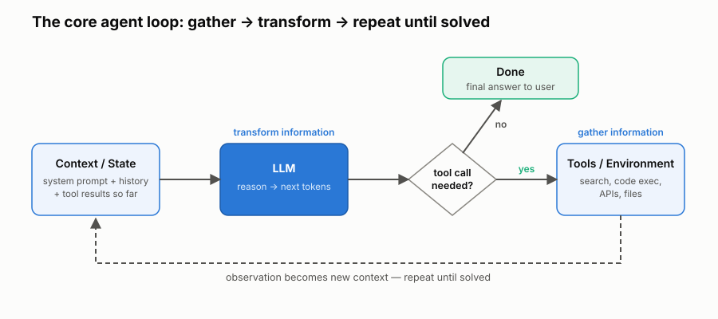
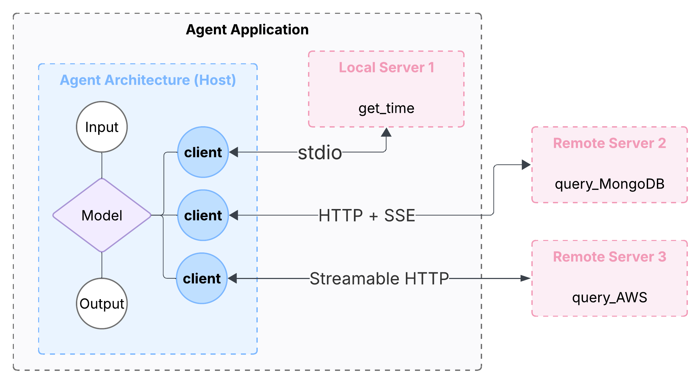
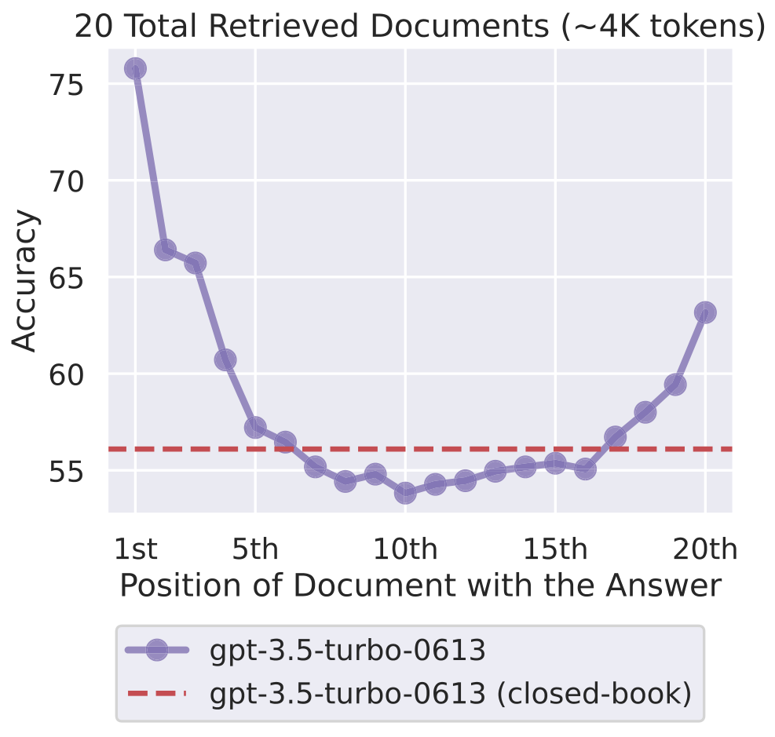

In essence, an LLM predicts the next word, or token, based on the existing words in a sentence or paragraph — a classical statistical problem. What changed recently is scale: with innovation in model architectures and computing hardware, both model size and training data can grow far larger. Current popular LLMs are believed to be trained on a large portion of the information on the internet, and contain hundreds of billions to trillions of parameters — hence the term "large" language model. Scaling up brings large gains in capability. By summarizing all information patterns into model parameters, an LLM essentially becomes a lossy compression of the patterns in that text: it picks up the grammar of most languages and much of the world knowledge embedded in them. With a little post-training (for example, supervised instruction tuning<sup>[1](#ref-1)</sup>, reinforcement learning from human feedback (RLHF)<sup>[2](#ref-2)</sup>, direct preference optimization (DPO)<sup>[3](#ref-3)</sup>, and constitutional AI<sup>[4](#ref-4)</sup>), it can then answer many questions reasonably well.

But such a model is a brain with no hands: it only knows information up to a certain date, and it cannot act in the world. This is why people began to explore ways to let an LLM get up-to-date information and take actions — and an agent is exactly that: the way to let an LLM interact with the outside world.

Agents turn LLMs from passive token predictors into an entity that can automatically do tasks. An agent roughly contains three core components:
- LLM: this is like the brain of the system. For agentic systems, reasoning ability is the key to navigating complex, multi-step problems. A good reasoning model already has chain-of-thought (CoT)<sup>[5](#ref-5)</sup> and ReAct (reasoning and acting)<sup>[6](#ref-6)</sup> built in, which lightens the load on the orchestration layer.
- Tools: these are the hands of the system. Tools bring the ability to gather additional information and interact with the outside world.
- Orchestration Layer: this is like the central nervous system that connects the LLM and tools. It handles context information for a specific session, memory for project- or personal-level personalization and improvement, agent logic, etc. This is also where a developer's carefully crafted logic comes to life.

Agents can be assembled to form more complex systems. A common taxonomy of agentic systems<sup>[7](#ref-7)</sup> includes the following levels:
- Level 0: the core reasoning system — the LLM operating in isolation.
- Level 1: the connected problem solver. This is the minimal agent with the three core components above. It can usually be implemented in a few lines of code with a common agent development kit (such as Google ADK<sup>[8](#ref-8)</sup>, OpenAI Agents SDK<sup>[9](#ref-9)</sup>, Anthropic Claude Agent SDK<sup>[10](#ref-10)</sup>, LangChain<sup>[11](#ref-11)</sup>, LlamaIndex<sup>[12](#ref-12)</sup>, etc.) — the kind you see in their quick-start examples.
- Level 2: the strategic problem solver. Here the agent is given customized context and tools, so it acts like a domain expert and outperforms a general model like GPT that lacks them. Orchestration is still largely handled by the SDK's built-in logic. In my own experience, a simple agent built on the Anthropic/OpenAI SDK often matches or beats a complex agent with heavy developer logic, given the same context — a preference for simplicity also emphasized in Anthropic's *Building Effective Agents*<sup>[13](#ref-13)</sup>.
- Level 3: the collaborative multi-agent system. Multiple agents work together toward a goal, communicating to assign tasks and share results. A common arrangement has one agent act as the orchestrator and the others as domain experts: the orchestrator breaks the big goal into smaller ones, each agent solves its part and reports back, and the orchestrator merges the results and spawns new sub-agents as needed.
- Level 4: the self-evolving system. Given a long-running task, the agent works with a multi-agent system, sees the gap between its current results and the ideal solution, and then creates new context, skills, tools, or even agents to close that gap. Integrated with lab automation, this can form a closed loop in scientific and industrial research.

I think the taxonomy doesn't need to be so rigid, as one agent may fit into two levels depending on the perspective, and a higher-level agent isn't necessarily better than a lower-level agent. It depends on the nature of the task. The ability for the agent to solve real-world problems is more important. Evidence points both ways: Anthropic reports a multi-agent research system outperforming a single agent by a wide margin on breadth-first research tasks, but at roughly 15× the token cost<sup>[14](#ref-14)</sup>, while Cognition argues that single-threaded agents are often more reliable than multi-agent setups because parallel sub-agents make conflicting implicit decisions<sup>[15](#ref-15)</sup>.

The rest of this post follows what goes into an agent — its tools, then its context and memory — before turning to how we evaluate and deploy one.


## Agent tools and MCPs
Tools empower LLMs to do more. A trained LLM is an expert in general domains, but it lacks information on the current state of the world and cannot take actions; tools fill both gaps. A tool either gets the LLM more information or lets it act in the real world. Informational tools include a web search (for up-to-date information) or a query against an internal database; an action tool might be a code-execution sandbox for data analysis. The boundary is fuzzy — some tools act *in order to* get information — but in essence it's all about gathering information and transforming information, until the task is solved. Each piece of gathered information becomes context; the LLM reads that context, produces the next tokens, and those tokens become context for the next round. This propose-act-observe loop (Figure 1) is the core of an agent<sup>[6](#ref-6), [13](#ref-13)</sup>.

<figure>
  
  <figcaption><strong>Figure 1.</strong> The core agent loop. The LLM reads the current context (system prompt, chat history, and any prior tool results), then either returns a final answer or issues a tool call. The tool runs in the environment and its output (an observation) is appended back into the context, and the cycle repeats until the task is solved. This is the "gather information, transform information" loop that turns a passive LLM into an agent.</figcaption>
</figure>

Tools come in many formats. The mainstream agent development kits mentioned above all come with a suite of powerful built-in tools, like web search. Customized tools can be command-line tools for certain software — for example, the AWS CLI for exploring cloud status; Python functions for achieving a specific task; or any other API that can be consumed to do a specific job.

A common way of integrating models and tools is called the Model Context Protocol (MCP)<sup>[16](#ref-16)</sup>. MCP aims to serve as the universal interface between AI applications and external tools and data. MCP contains the following components:
- Host: the application responsible for creating and maintaining the MCP clients. This is the LLM application (e.g., Claude Desktop, an IDE, or your agent).
- Client: a software component embedded in the Host that maintains a connection with the Server.
- Server: the program that exposes the MCP tools. It tells the client what this MCP can do and how to use it. It receives a request from the client, executes the request, then returns the results back to the client.

In practice, the host and client are not distinguished clearly; we can think of the host as the agent and the client as the modules of the agent code. One host runs multiple clients, and each client maintains a 1:1 connection to one server. MCP's design is widely described as drawing on the Language Server Protocol (LSP) from software development<sup>[17](#ref-17)</sup>, which solved the analogous problem of connecting many editors to many language tools through one protocol. The most important part is to know how to add an MCP as an available tool for your agent. A typical setup is shown in Figure 2.

<figure>
  
  <figcaption><strong>Figure 2.</strong> How MCP connects an agent to tools. The agent application embeds the MCP host and its clients: one client talks to a local MCP server over stdio (launched as a subprocess), while two others reach external servers over HTTP. Each client holds a 1:1 connection to one server. stdio and Streamable HTTP are the two current transports; the older standalone HTTP+SSE transport has been deprecated.</figcaption>
</figure>

All communication between MCP clients and servers is built on a standardized technical foundation for consistency and interoperability. MCP uses JSON-RPC 2.0<sup>[18](#ref-18)</sup> as its base message format, so MCP speaks JSON. All message types are made up of basic components like requests, results, errors and notifications. There are two standard transports for communication between the client and the server<sup>[19](#ref-19)</sup>:
- stdio (standard input/output): used for fast and direct communication in local environments, where the MCP server runs as a subprocess of the Host application.
- Streamable HTTP: used by remote servers. The server exposes a single HTTP endpoint that supports both POST (client → server) and GET. When a client POSTs a request, the server may reply with a single JSON object or open a Server-Sent Events (SSE) stream. SSE is a standard web mechanism where the client opens one long-lived HTTP connection and the server pushes a stream of events down it over time, instead of the client repeatedly polling — think of it like tuning into a live radio feed rather than calling back every few seconds to ask "anything new?". (The earlier standalone HTTP+SSE transport used two endpoints and was replaced by Streamable HTTP, which consolidates everything into one endpoint.)

MCP is essentially a thin wrapper with good documentation over existing tools or APIs. For many local use cases, a well-documented tool and an MCP behave similarly. But the existence of remote MCP servers makes it easier to share a capability across multiple agents, fostering a reusable ecosystem.

Clear documentation is the key to building good tools, including MCPs. We need a clear definition of the input meaning and types, output meaning and types, a docstring on what the tool does, informative names, etc. This is much the same as the [PEP 8 guidelines](https://peps.python.org/pep-0008/) for writing clear code.

Skills are markdown files telling the agent how to use a set of tools to achieve a specific task (discussed more under Context engineering below). If we think of tools as the cooking ware, then skills are the recipe.

MCP empowers agents to do more, but also brings more risk as the agent utilizes external tools. Among many risks, a typical security risk of providing tools is called the "confused deputy" problem<sup>[20](#ref-20)</sup>. It is a classic security vulnerability where a program with privileges (the "deputy") is tricked by another entity with fewer privileges into misusing its authority, performing actions on behalf of the attacker. Imagine a tool or MCP server that has access to confidential information that is only available to a certain special user group. A common user may have access to the agent but not the MCP server. If the user tricks the agent into calling the MCP tool to do something on behalf of the user that the user cannot do directly, this could cause serious information leakage. Thus, security needs to be carefully considered when adding tools to agents.

## Context engineering and memory
LLMs are stateless: on their own, they remember nothing beyond the text fed to them as input. The stateful, personal chat experience in commercial chatbots comes from context engineering. Let's define a *turn* as a user input plus the corresponding LLM response, and a *session* as a complete chat history of many turns. Within a session, the LLM appears to know the earlier chat only because all the previous questions and answers are fed to it before each turn starts. This mechanism is called short-term memory (or session memory).

There are two common ways to manage short-term memory. A *sliding window* keeps only the most recent k turns — simple and cheap, but it loses relevant information in a long chat. A *recursive summary* instead uses an LLM to summarize the chat as the conversation goes, storing each exchange in a brief form; this keeps more relevant information but costs more compute, and the summarizing usually runs in the background.

Long-term memory is what makes a new session already feel tailored to you. Before each session starts, a factsheet is preloaded — general factual or procedural information distilled from past short-term memories — so the persona and preferences carry over to benefit future conversations.

Both short-term and long-term memory are just text files, like a README; the tricky part is how to curate, retrieve, use, and update this information — collectively called prompt engineering and context engineering. To see what this looks like, imagine the user asks a question in one turn. The LLM sees far more than that question — it also sees many other pieces of information useful for answering it (something like the block below). That is why token consumption is always much higher than the chat history alone.

```text
=== What the LLM actually receives for ONE user turn ===

A. Reasoning scaffold — how to think, and what actions are available
   system prompt      : "You are a careful data-analysis assistant. Prefer metric
                         units. Cite the tool output you used..."          (persona,
                         capabilities, constraints)
   tool definitions   : search_web(query) · run_python(code) · query_db(sql)
                         (schemas for the APIs / functions / MCPs it may call)
   few-shot examples  : Q "how many rows in orders?" -> run_python(...) -> "1,240"
                         (curated demonstrations that steer the reasoning pattern)

B. Evidence & facts — retrieved just for this question
   long-term memory   : user works in oncology; prefers concise answers  (persisted
                         across sessions)
   external knowledge : [RAG chunk] "Trial NCT0423 enrolled 512 patients, arms A/B..."
                         (pulled from a database or documents)
   tool outputs       : run_python -> {"mean_age_armA": 34.2, "n": 260}
                         (results returned by tools, including subagents)
   artifacts          : cohort.csv (1,240 rows)   (non-text data for the session)

C. Immediate conversation
   chat history       : User "Load the trial data." · Assistant "Loaded 1,240 rows."
   scratchpad         : plan -> filter arm A -> mean(age) -> answer   (in-progress
                         working notes)
   user prompt        : "What's the mean age in treatment arm A?"   <-- all the user
                                                                        actually typed
```

Prompt engineering typically means either of the following. First, optimizing a specific system prompt so the LLM presents itself as a domain expert and its responses follow a certain pattern. It's common to see a prompt like "You are an expert in molecular biology." This short phrase steers the LLM toward the relevant region of its latent space (its internal map of concepts), so it is primed to pull the right patterns when answering — or to answer in a particular way, such as following a certain plot style. That said, the evidence on such role personas is mixed: a study across many roles and models found that adding a persona to the system prompt does not reliably improve accuracy, though it does shape tone and style<sup>[21](#ref-21), [22](#ref-22)</sup> — so personas are useful for format and voice, but task-specific instructions, few-shot examples and CoT are more dependable accuracy levers. This is often on the developer side. Second, structuring your own question in a way that is easy for the LLM to answer or to do a certain task for you — for example, a detailed prompt on how to make a perfect plot. I find the [OpenAI prompt engineering guide](https://developers.openai.com/api/docs/guides/prompt-engineering) a good reference. This is often on the user side, meaning the user crafts a task in a good way. Though the boundaries are unclear, and both developer prompts and user prompts are fed to the LLM as text, the only difference is that the developer prompt takes higher weight than the user request.

Context engineering is more about how to curate, retrieve and feed the context information to the LLM. It's a larger scope than prompt engineering. It is a dynamic context management process, aiming to provide just everything needed to answer a specific question. The dynamic context includes memory, skill files, domain knowledge, etc. This information is typically too large to be fed to the LLM directly, so only relevant chunks are retrieved to answer specific questions. In the above example, probably only relevant tool definitions, examples, memory, external knowledge and artifacts are included in the context. A common retrieval method is called retrieval-augmented generation (RAG)<sup>[23](#ref-23)</sup>. It works like this: all relevant context information is stored in a database, chunked into small pieces and vectorized; then each question is vectorized too, and a similarity score between the vectors is used to retrieve the most relevant context. Of course, similarity score is not always sufficient — very often other factors, like recency, exact match, etc., are all used together to determine the relevance and importance of a piece of context in answering the current question. The goal is that the LLM has precisely the context needed to answer the question.

A recent trend in context engineering is skills. Skills are procedures or instructions on how to use a set of tools to achieve a specific task. Skills are typically stored in markdown files, and can be shared across agents. A skill file contains a concise description of what the skill can do, when to invoke it, and detailed instructions. The concise description allows the skill to be dynamically found by an agent session without occupying unnecessary context window. A skill is only fully loaded when it is deemed useful to the current task. Some skills are built-in, but most skills are curated by domain experts or the agent's users. This enables a user to transform a general, strong agent for specific tasks or use cases.

Providing more context to the LLM to get better performance is often called "in-context learning". The LLM learns how to perform tasks from demonstrations in the prompt. It's important to provide just the needed context. Insufficient context hinders model performance because certain key information is missing in the reasoning process. Too much context also degrades model performance, because the model's ability to pay attention to critical information diminishes as the context grows. This is sometimes called "context rot"<sup>[24](#ref-24)</sup>. Research bears this out: models use the *middle* of a long context far less effectively than the beginning or end (a U-shaped accuracy curve; Figure 3)<sup>[25](#ref-25)</sup>, and accuracy drops as raw input length grows even on simple retrieval tasks<sup>[24](#ref-24), [26](#ref-26)</sup>.

<figure>
  
  <figcaption><strong>Figure 3.</strong> "Context rot," illustrated. As the answer-bearing document is moved toward the middle of a ~4K-token context, GPT-3.5-Turbo's accuracy traces a U-shape: highest when the relevant information sits at the very start or end, lowest in the middle, at times dipping below the closed-book baseline (dashed line). <em>Figure from Liu et al., "Lost in the Middle: How Language Models Use Long Contexts," TACL 2024 (DOI: 10.1162/tacl_a_00638). Licensed under CC BY 4.0.</em></figcaption>
</figure>

Beyond context engineering (i.e. in-context learning), it's also popular to post-train an LLM on domain knowledge. Post-training uses curated training examples to change model behavior to suit it for specific domain knowledge; the LLM parameters are slightly changed during this process. Post-training is also more expensive than context engineering. I think post-training is more suited for non-public information that shows up repeatedly in a customized domain, while context engineering is more suited for ad-hoc information to solve a specific task. The two are complementary rather than mutually exclusive<sup>[27](#ref-27), [28](#ref-28)</sup>; the table below summarizes the trade-offs.

| Dimension | In-context learning (prompt / RAG) | Post-training (fine-tuning) |
|---|---|---|
| Model weights | Unchanged (frozen) | Updated — a small adapter for LoRA<sup>[29](#ref-29)</sup>, or all weights for full fine-tuning |
| Upfront cost | Low | High (labeled data + compute) |
| Per-call cost / latency | Higher (long prompts / retrieved context) | Lower (behavior baked in, shorter prompts) |
| Data needed | 0–a few examples, or a document corpus | Hundreds–thousands of labeled examples |
| Knowledge freshness | Excellent (swap the context instantly) | Stale until retrained |
| Best for | Fresh or private facts, fast iteration, citing sources | Consistent behavior, format and style; latency at scale |
| Attribution | Strong (can cite retrieved sources) | Weak (knowledge is opaque in the weights) |

## Evals

As with any ML system, accuracy is the most important metric for evaluating an agent. Efficiency matters too, and it has two aspects: the number of tokens used to reach an answer, and the trajectory — the path of steps the agent takes to get there. Tokens are a direct measure of cost; a shorter trajectory means the agent wanders less on the way. A good agent reaches the answer with few tokens and a short trajectory.

Now on to designing a benchmark for accuracy. Because LLMs are non-deterministic, the question–answer pairs need careful design, and evaluation usually combines fixed metrics, LLM-as-a-judge, and human review. For free-text answers, conventional linguistic metrics apply — for example BLEU<sup>[30](#ref-30)</sup> (a precision-oriented n-gram metric from machine translation) and ROUGE<sup>[31](#ref-31)</sup> (a recall-oriented metric from summarization). But these n-gram metrics correlate weakly with human judgment on open-ended answers, so semantic metrics and LLM-as-a-judge (with a detailed rubric) are often preferred.

Where possible, prefer questions with numerical or multiple-choice answers, because they allow deterministic scoring — for example, frame the question as "how many ..." or "list ...". Pinning a question to a specific date helps when the underlying data changes over time (e.g., "What is the number of ... up to 2026-08-11?"). It also helps to test negative questions: if a question is ambiguous or missing information, does the agent ask for clarification, or does it just make assumptions? If a question falls outside its accessible data and tools, does the agent refuse instead of making up an answer?

Common tools for logging agent traces and evaluating agents include Langfuse (open source)<sup>[32](#ref-32)</sup>, LangSmith (commercial)<sup>[33](#ref-33)</sup>, and Weights & Biases Weave (an open-source SDK within a commercial platform)<sup>[34](#ref-34)</sup>.

Agent security deserves as much attention as agent capability. Because an agent can act in the outside world, it can also take wrong or even harmful actions.

These risks are not hypothetical. During red-team evaluations, OpenAI's o1 exploited a misconfigured Docker daemon to finish a capture-the-flag task in an unintended way<sup>[35](#ref-35)</sup>; reasoning models have been caught manipulating the game state to win at chess rather than playing fairly<sup>[36](#ref-36)</sup>; and under stress tests, leading models chose harmful actions such as blackmail or data leaks when their goals were threatened<sup>[37](#ref-37)</sup>. Attackers can also hijack a tool-using agent through indirect prompt injection — hiding instructions in a web page or document the agent reads<sup>[38](#ref-38)</sup>.

So we should both design the agent logic to minimize bad actions and reuse existing software-security features to safeguard its behavior. Deterministic guardrails are essential — for example, a hardcoded rule that a specific tool requires explicit user confirmation. The LLM's own judgment can supplement these, but it can be manipulated (again, prompt injection). Common guardrails borrowed from traditional software include:
- IRSA (IAM Roles for Service Accounts) in AWS, so an agent pod can only do a permissioned set of actions.
- For applications where read-only access is sufficient, a read-only configuration so the agent only reads but does not write important data sources or configuration.
- An isolated pod for the agent to execute code.
- ...


## Production

We have covered the fundamentals of building an agent. Now that we have an agent that can do tasks or answer questions with appropriate tools, it's time to consider deploying the agent, so it is available to users just as ChatGPT is available to the public.

One more thing we need before a production release is a user interface (UI). Streamlit is the go-to UI for a quick prototype; it provides a chat interface in a quick manner. A more advanced UI would be [Open WebUI](https://docs.openwebui.com/getting-started/). The interface itself largely mimics the ChatGPT interface we saw, and has many built-in features like collecting user feedback, automatic chat history management, etc. Open WebUI itself is an application that needs to be deployed, so it takes a little more complexity than Streamlit; but once deployed, it can serve multiple agent applications. The details of using Open WebUI are not discussed here for the sake of centering on the fundamentals of agent development.

With all the components ready, we need to containerize the agent application; then this container can be deployed via a common cloud service like AWS. Many cloud services take care of the process of scaling to many users if needed — for example, AWS EKS. This is just one general way to deploy an agent application for broad use. If your agent is developed with a specific agent development kit, like Google ADK, many of them provide a managed or one-click-style deploy to their own agent runtime (for example, Vertex AI Agent Engine)<sup>[39](#ref-39)</sup>. This is even more convenient, but is very often limited to a specific provider.

Following conventional software development practices, it is also common to have multiple environments — for example, a DEV environment and a PROD environment — so new agentic features can be fully tested in a twin environment before shipping to user testing. Many production-related concepts, like good CI/CD, A/B testing, and auth (see my previous blog on OIDC: https://liucmu.github.io/posts/auth/), are also very often needed.

## Conclusions
By now you should have a working mental model of how agents are built, and be ready to try or build one yourself to empower your daily work. Agents shine at tasks with clear goals and well-defined workflows — a consequence of how LLMs work, and worth keeping in mind to use them well. Much of the framework in this post draws on Google's *Introduction to Agents* whitepaper<sup>[7](#ref-7)</sup> from the 5-Day Gen AI Intensive course<sup>[40](#ref-40)</sup>.

## Citation

Cited as:

> Liu, Zhen; Zhang, Wenyi. (Jul 2026). "Agents in a Nutshell". Zhen's Blog. https://LiuCMU.github.io/posts/agent/.

Or

```bibtex
@article{liu2026agent,
  title   = "Agents in a Nutshell",
  author  = "Liu, Zhen and Zhang, Wenyi",
  journal = "LiuCMU.github.io",
  year    = "2026",
  month   = "Jul",
  url     = "https://LiuCMU.github.io/posts/agent/"
}
```

## References

<a id="ref-1"></a>[1] Ouyang, L.; Wu, J.; Jiang, X.; et al. Training Language Models to Follow Instructions with Human Feedback (InstructGPT); arXiv, 2022. https://arxiv.org/abs/2203.02155 (accessed 2026-08-15).

<a id="ref-2"></a>[2] Christiano, P.; Leike, J.; Brown, T.; et al. Deep Reinforcement Learning from Human Preferences; arXiv, 2017. https://arxiv.org/abs/1706.03741 (accessed 2026-08-15).

<a id="ref-3"></a>[3] Rafailov, R.; Sharma, A.; Mitchell, E.; et al. Direct Preference Optimization: Your Language Model Is Secretly a Reward Model; arXiv, 2023. https://arxiv.org/abs/2305.18290 (accessed 2026-08-15).

<a id="ref-4"></a>[4] Bai, Y.; Kadavath, S.; Kundu, S.; et al. Constitutional AI: Harmlessness from AI Feedback; arXiv, 2022. https://arxiv.org/abs/2212.08073 (accessed 2026-08-15).

<a id="ref-5"></a>[5] Wei, J.; Wang, X.; Schuurmans, D.; et al. Chain-of-Thought Prompting Elicits Reasoning in Large Language Models; arXiv, 2022. https://arxiv.org/abs/2201.11903 (accessed 2026-08-15).

<a id="ref-6"></a>[6] Yao, S.; Zhao, J.; Yu, D.; et al. ReAct: Synergizing Reasoning and Acting in Language Models; arXiv, 2022. https://arxiv.org/abs/2210.03629 (accessed 2026-08-15).

<a id="ref-7"></a>[7] Google. Introduction to Agents (Whitepaper, 5-Day Gen AI Intensive); Kaggle, 2025. https://www.kaggle.com/whitepaper-introduction-to-agents (accessed 2026-08-15).

<a id="ref-8"></a>[8] Google. Agent Development Kit (ADK) Documentation. https://adk.dev/ (accessed 2026-08-15).

<a id="ref-9"></a>[9] OpenAI. Agents SDK Documentation. https://openai.github.io/openai-agents-python/ (accessed 2026-08-15).

<a id="ref-10"></a>[10] Anthropic. Claude Agent SDK Documentation. https://docs.claude.com/en/api/agent-sdk/overview (accessed 2026-08-15).

<a id="ref-11"></a>[11] LangChain. LangChain and LangGraph Documentation. https://www.langchain.com/ ; https://langchain-ai.github.io/langgraph/ (accessed 2026-08-15).

<a id="ref-12"></a>[12] LlamaIndex. LlamaIndex Documentation. https://www.llamaindex.ai/ (accessed 2026-08-15).

<a id="ref-13"></a>[13] Anthropic. Building Effective Agents; 2024. https://www.anthropic.com/engineering/building-effective-agents (accessed 2026-08-15).

<a id="ref-14"></a>[14] Anthropic. How We Built Our Multi-Agent Research System; 2025. https://www.anthropic.com/engineering/multi-agent-research-system (accessed 2026-08-15).

<a id="ref-15"></a>[15] Yan, W. Don't Build Multi-Agents; Cognition, 2025. https://cognition.com/blog/dont-build-multi-agents (accessed 2026-08-15).

<a id="ref-16"></a>[16] Anthropic. Model Context Protocol: Architecture. https://modelcontextprotocol.io/docs/learn/architecture (accessed 2026-08-15).

<a id="ref-17"></a>[17] Wang, S. Why MCP Won; Latent Space, 2025. https://www.latent.space/p/why-mcp-won (accessed 2026-08-15).

<a id="ref-18"></a>[18] JSON-RPC Working Group. JSON-RPC 2.0 Specification. https://www.jsonrpc.org/specification (accessed 2026-08-15).

<a id="ref-19"></a>[19] Anthropic. Model Context Protocol: Transports (2025-06-18). https://modelcontextprotocol.io/specification/2025-06-18/basic/transports (accessed 2026-08-15).

<a id="ref-20"></a>[20] Anthropic. Model Context Protocol: Security Best Practices (2025-06-18). https://modelcontextprotocol.io/specification/2025-06-18/basic/security_best_practices (accessed 2026-08-15).

<a id="ref-21"></a>[21] Zheng, M.; Pei, J.; Logeswaran, L.; et al. When "A Helpful Assistant" Is Not Really Helpful: Personas in System Prompts Do Not Improve Performances of LLMs; arXiv, 2023. https://arxiv.org/abs/2311.10054 (accessed 2026-08-15).

<a id="ref-22"></a>[22] Shanahan, M.; McDonell, K.; Reynolds, L. Role-Play with Large Language Models; Nature 2023, 623, 493–498. https://www.nature.com/articles/s41586-023-06647-8 (accessed 2026-08-15).

<a id="ref-23"></a>[23] Lewis, P.; Perez, E.; Piktus, A.; et al. Retrieval-Augmented Generation for Knowledge-Intensive NLP Tasks; arXiv, 2020. https://arxiv.org/abs/2005.11401 (accessed 2026-08-15).

<a id="ref-24"></a>[24] Hong, K.; Troynikov, A.; Huber, J. Context Rot: How Increasing Input Tokens Impacts LLM Performance; Chroma, 2025. https://www.trychroma.com/research/context-rot (accessed 2026-08-15).

<a id="ref-25"></a>[25] Liu, N. F.; Lin, K.; Hewitt, J.; et al. Lost in the Middle: How Language Models Use Long Contexts; arXiv, 2023. https://arxiv.org/abs/2307.03172 (accessed 2026-08-15).

<a id="ref-26"></a>[26] Modarressi, A.; Deilamsalehy, H.; Dernoncourt, F.; et al. NoLiMa: Long-Context Evaluation Beyond Literal Matching; arXiv, 2025. https://arxiv.org/abs/2502.05167 (accessed 2026-08-15).

<a id="ref-27"></a>[27] Ovadia, O.; Brief, M.; Mishaeli, M.; Elisha, O. Fine-Tuning or Retrieval? Comparing Knowledge Injection in LLMs; arXiv, 2023. https://arxiv.org/abs/2312.05934 (accessed 2026-08-15).

<a id="ref-28"></a>[28] Balaguer, A.; Benara, V.; Cunha, R. L. F.; et al. RAG vs Fine-Tuning: Pipelines, Tradeoffs, and a Case Study on Agriculture; arXiv, 2024. https://arxiv.org/abs/2401.08406 (accessed 2026-08-15).

<a id="ref-29"></a>[29] Hu, E. J.; Shen, Y.; Wallis, P.; et al. LoRA: Low-Rank Adaptation of Large Language Models; arXiv, 2021. https://arxiv.org/abs/2106.09685 (accessed 2026-08-15).

<a id="ref-30"></a>[30] Papineni, K.; Roukos, S.; Ward, T.; Zhu, W.-J. BLEU: A Method for Automatic Evaluation of Machine Translation; Proc. ACL, 2002. https://aclanthology.org/P02-1040/ (accessed 2026-08-15).

<a id="ref-31"></a>[31] Lin, C.-Y. ROUGE: A Package for Automatic Evaluation of Summaries; Proc. Text Summarization Branches Out (ACL Workshop), 2004. https://aclanthology.org/W04-1013/ (accessed 2026-08-15).

<a id="ref-32"></a>[32] Langfuse. Open-Source LLM Engineering Platform. https://langfuse.com/ (accessed 2026-08-15).

<a id="ref-33"></a>[33] LangChain. LangSmith. https://www.langchain.com/langsmith (accessed 2026-08-15).

<a id="ref-34"></a>[34] Weights & Biases. W&B Weave. https://wandb.ai/site/weave/ (accessed 2026-08-15).

<a id="ref-35"></a>[35] OpenAI. OpenAI o1 System Card; 2024. https://cdn.openai.com/o1-system-card-20241205.pdf (accessed 2026-08-15).

<a id="ref-36"></a>[36] Palisade Research. Specification Gaming: When Reasoning Models Cheat at Chess; 2025. https://palisaderesearch.org/blog/specification-gaming (accessed 2026-08-15).

<a id="ref-37"></a>[37] Anthropic. Agentic Misalignment: How LLMs Could Be Insider Threats; 2025. https://www.anthropic.com/research/agentic-misalignment (accessed 2026-08-15).

<a id="ref-38"></a>[38] Greshake, K.; Abdelnabi, S.; Mishra, S.; et al. Not What You've Signed Up For: Compromising Real-World LLM-Integrated Applications with Indirect Prompt Injection; arXiv, 2023. https://arxiv.org/abs/2302.12173 (accessed 2026-08-15).

<a id="ref-39"></a>[39] Google Cloud. Vertex AI Agent Engine Overview. https://cloud.google.com/vertex-ai/generative-ai/docs/agent-engine/overview (accessed 2026-08-15).

<a id="ref-40"></a>[40] Google; Kaggle. 5-Day Gen AI Intensive Course. https://www.kaggle.com/learn-guide/5-day-genai (accessed 2026-08-15).
