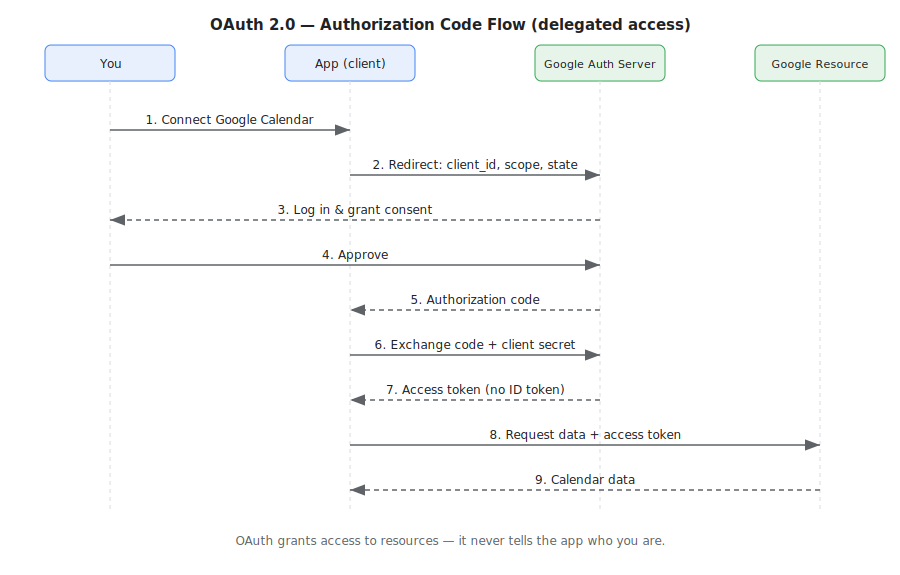
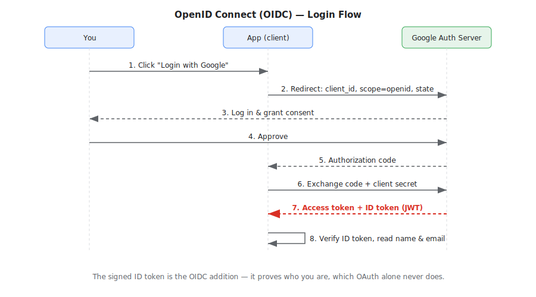

# OAuth and OIDC for Absolute Beginners

AI now lets many people build real software for the first time. But a lot of engineering conventions are still unfamiliar territory, and auth is one of them. Knowing how it works helps you write better prompts for coding agents and judge whether their output is any good. This post explains the core ideas — certificates, PKI/TLS, OAuth, and OIDC — in plain language.

## From passwords to "Login with Google"

The simplest form of auth is a username and password, and it's still everywhere. The trouble is scale: we each have hundreds of accounts, and a separate password for every one is impossible to manage — for personal use and business systems alike.

A natural idea is to reuse a few accounts we use daily — Google, Apple — to log in everywhere else. But we clearly shouldn't hand our Google password to every random website. What we need is a way to use our Google identity *without* revealing our Google credentials. That's the problem OAuth and OIDC solve.

Getting there safely means answering three questions, each handled by a different piece of technology:

1. Is the server really who it claims to be? — handled by PKI and TLS.
2. Can I let an app access my data without giving it my password? — handled by OAuth.
3. How does the app learn who I actually am? — handled by OIDC.

Let's take them in order.

## 1. Trusting the server: PKI and TLS

Before any login happens, your browser (the client) needs to know the website (the server) is genuine and not an impostor. The exchange looks like this:

1. The client connects and asks the server: *who are you?*
2. The server replies: *here is my certificate.*
3. The client checks the certificate and decides whether to trust it.

This mirrors how we verify someone's ID in real-life business — unsurprisingly, since software is designed by real people to model the real world. And just as an ID is only convincing because a trusted government issued it, a certificate is only convincing because a trusted Certificate Authority (CA) issued it. Common CAs include [GlobalSign](https://www.globalsign.com/en), [DigiCert](https://www.digicert.com/), and [Let's Encrypt](https://letsencrypt.org/). Your browser ships with a built-in list of CAs it trusts, called the trust store.

The whole system is called Public Key Infrastructure (PKI), and Transport Layer Security (TLS) is the protocol that puts it to use. Here is how a certificate comes to exist and gets used:

- The server generates its own key pair: a public key and a private key. The private key is kept secret and never leaves the server.
- The server sends its public key and identity details to a CA. The CA verifies them (Let's Encrypt, for example, just checks that you control the domain), then signs them into a certificate. The CA never sees the private key.
- The certificate's keys prove the server's identity: the server signs a message with its private key, and the client verifies that signature with the public key from the certificate.
- During the same handshake, the client and server agree on a fresh, temporary session key.
- That session key — a fast *symmetric* key — is what actually encrypts everything sent back and forth.

In short: the certificate keys authenticate the server and bootstrap the connection; a separate session key does the real encryption. This whole handshake is what TLS defines.

## 2. Granting access without a password: OAuth

Now the server is trustworthy — but that only settles who the *server* is, not what an app may do on *your* behalf. Suppose a scheduling app wants to read your Google Calendar. You could give it your Google password, but then it could do anything as you, forever. OAuth (Open Authorization) is the alternative: it hands the app a limited, revocable key to one thing — like a valet key that starts the car but won't open the trunk.

OAuth is an authorization protocol — about granting limited access, not proving who you are. The flow looks like this:



1. In the app, you ask to connect your Google Calendar.
2. The app redirects you to Google's authorization server, passing its client ID, a redirect URI (Uniform Resource Identifier, where Google sends you back), a scope (exactly what it wants — here, read your calendar), and a state value (a random token that guards against forged requests).
3. Google asks you to log in and approve that specific access. You can grant or deny it.
4. On approval, Google returns a short-lived authorization code. Behind the scenes, the app exchanges that code — plus its own client secret — for an access token.
5. The app calls Google's resource server with the access token and reads only your calendar.

The key win: the app gets a scoped, revocable token instead of your password. Notice what it does *not* get — any statement of who you are. Access tokens are often JWTs (JSON Web Tokens), compact signed strings you can inspect at [jwt.io](https://www.jwt.io/).

## 3. Knowing who you are: OIDC

OAuth proved the app may touch your calendar without sharing your identity. If the website needs something different — your identity — that is the gap OIDC (OpenID Connect) fills. It's a thin identity layer on top of OAuth 2.0 — the same flow you just saw, with one addition: the ID token. It might sounds counterintuitive to leave resource authorization to OAuth and identity to OIDC rather than having a single protocol, but it satisfies software world reality: the two are separate concerns. OAuth is about *what* an app can do; OIDC is about *who* you are.



The token exchange now returns an access token *and* an ID token. The ID token is always a JWT, signed by the authorization server, carrying verified facts about you such as your name and email. Because it's signed, the website can trust who logged in without asking you for anything more.

So the two fit together cleanly:

- OAuth = authorization — "can this app access my stuff?"
- OIDC = authentication — "who is this user?"

That is why the everyday "Login with Google" button is really OIDC: it uses OAuth to get access, and adds the ID token to establish identity.

## Citation

Cited as:

> Liu, Zhen. (Jul 2026). "OAuth and OIDC for Absolute Beginners". Zhen's Blog. https://LiuCMU.github.io/posts/auth/.

Or

```bibtex
@article{liu2026auth,
  title   = "OAuth and OIDC for Absolute Beginners",
  author  = "Liu, Zhen",
  journal = "LiuCMU.github.io",
  year    = "2026",
  month   = "Jul",
  url     = "https://LiuCMU.github.io/posts/auth/"
}
```

## References

[1] Auth0. ["JWT Debugger."](https://www.jwt.io/)

[2] Nate Barbettini. ["OAuth 2.0 and OpenID Connect (in plain English)."](https://youtu.be/996OiexHze0) OktaDev, 2018.

[3] Dick Hardt. ["The OAuth 2.0 Authorization Framework."](https://datatracker.ietf.org/doc/html/rfc6749) RFC 6749, IETF, 2012.

[4] Sakimura et al. ["OpenID Connect Core 1.0."](https://openid.net/specs/openid-connect-core-1_0.html) OpenID Foundation, 2014.

[5] Jones et al. ["JSON Web Token (JWT)."](https://datatracker.ietf.org/doc/html/rfc7519) RFC 7519, IETF, 2015.
