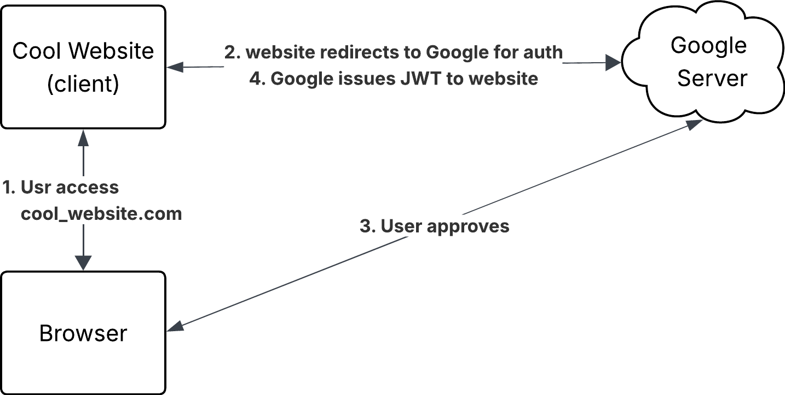

# Authentication and Authorization in Plain Language

This post explains auth (authentication) and authz (authorization) in plain language. With the power of AI, many scientist can build projects in an unprecedented way (myself included). This will for sure accelerate the pace of scientific discovery. However, many engineering conventions are not well known to scientists. Without knowing this concept, we can hardly provide effective prompts to Agents and judge the quality of their responses. This post is a brief introduction to concepts, and how they are used in practice in plain language. The goal is to help scientists understand the concepts and use them in practice.

Auth in the simplist form can just be the username and password. This is the foundation of auth and is still widely used nowadays. This simple format becomes insufficient when our needs change in the real world. Nowadays, everyone has hundreds of accounts, each of which requires a authentication method. Creating a password for each account is satisfies the basic need of auth, but it is really hard to mamange all the accounts and passwords. 

Of the hundreds of accounts, some are used more frequently than others. For example, our Google account or Apple account is used almost daily. One natural idea to remove unnecessary passwords is to use a few common accounts like Google or Apple to login to other accounts. However, providing our Google or Apple account and passwords to other accounts is not a good idea. We need a way to safely use our Google or Apple account to login to other accounts without providing our credentials. This is where OAuth and OIDC come into play.

Before OAuth takes place, certificates are used to verify the identity of the server. Let's define client as the side requiring certain service, e.g. a browswer. The server be the side that provides certain service, e.g. a website that provides information. The first phase is all about answering who the server is and whether the client can trust the server. In the browswer example, the process is as follows:

1. Whenever your enter a website, the client reach out and ask the wesite server: who are you?
2. The website server answers the client: I'm a server for this website. Here is my certificate
3.  The client receives the certificate, verify it, and decide whether to trust the server.

This process works exactly as how we use our ID to show our identity to ours. And the software world mimic the real world in this way. And There is a large software infrastructure to support this process, mainly public key infrastructure (PKI) and transport layer security (TLS). PKI consists of several pieces, including certificate authority (CA), certificate,public key, private key, rules for validation, trust store and so on. TLS is a protocol that uses PKI to provide secure communication between client and server.

The CA is like goverments that issues passports and ID cards. Some common CA include [GlobalSign](https://www.globalsign.com/en), [DigiCert](https://www.digicert.com/), and [Let's Encrypt](https://letsencrypt.org/). Most well known servers obtain their certificates from mainstream CAs. and most clients have a built-in list of trusted CAs, which is called trust store. During the registration process, the CA verifies the identity of the server. The CA then issues a certificate and private key to the server [need to validate]. The certificate is like a passport or ID card that proves the identity of the server. The certificate contains the public key of the server, which is used to encrypt the communication between client and server. The private key is kept secret by the server and is used to decrypt the communication. The protocol for communication encryption is called TLS.

After establishing the identity of the server, we can move on to the next phase of auth. If we think the first phase is about establishing trust between client and server, the second phase is about establishing trust between client and user. The user is the person who uses the client to access the server. The user needs to prove their identity to the client, and the client needs to prove their identity to the server. This is where OAuth and OIDC come into play. 

Again, let's use the browser example. The user wants to access a cool website that requires authentication. The user can use their Google account to login to the website. The OAuth process is as follows:

1. User accesses the website and clicks on the "Login with Google" button.
2. The website redirects the user to the Google login page for auth. Under the hood, the redirect URL contains the client ID of the website, the redirect URI of the website (which redirects the user back to the website after auth), and the scope of the access request (which defines what information the website wants to access from the user's Google account).
3. Google asks the user to login and grant permission to the website to access their Google account. The user can choose to grant or deny the permission.
4. If the user grants permission, Google redirects the user back to the website with an authorization code. The website then exchanges the authorization code for an access token and ID token from Google. Sometimes JWT (JSON Web Token) is used to encode the access token and ID token. [This website](https://www.jwt.io/) is a great website to play with JWT encoding and decoding. The access token is used to access the user's Google account. Note that Google can have a Authorization server and a Resource server. The Authorization server is responsible for issuing access tokens and ID tokens, while the Resource server is responsible for providing access to the user's Google account. The access token is used to access the Resource server, while the ID token is used to verify the identity of the user. 
5. Once the website receives the access token and ID token, it can use them to access the user's Google account and retrieve the information it needs. 

You might also hear OIDC (OpenID Connect) in the context of OAuth. OIDC is an identity layer on top of OAuth 2.0 that allows clients to verify the identity of the user based on the authentication performed by an authorization server. Think of OAuth as a protocol for getting access to many different resources, while OIDC is a special case of OAuth that is specifically designed for authentication. OIDC uses the same flow as OAuth, but it adds an ID token that contains information about the user, such as their name and email address. The ID token is a JWT that is signed by the authorization server, which allows the client to verify its authenticity.

## Useful References
1. [jtw.io](https://www.jwt.io/) is a great website to play with JWT encoding and decoding. 
2. The [YouTube Video by Nate Barbettini](https://youtu.be/996OiexHze0) introduces the concepts and examples of OAuth and OIDC in very easy to understand way.